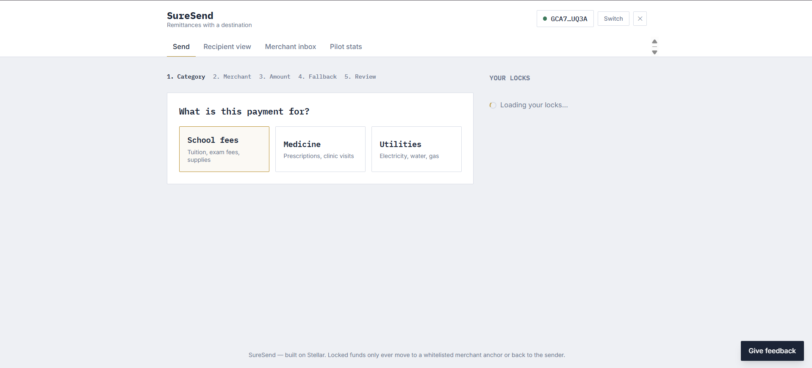
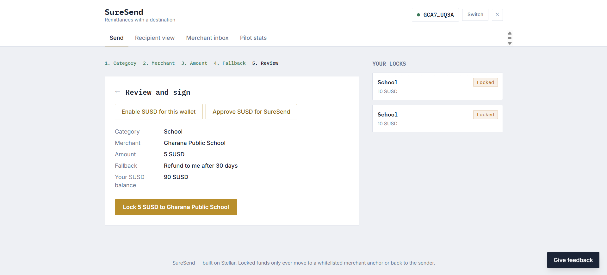
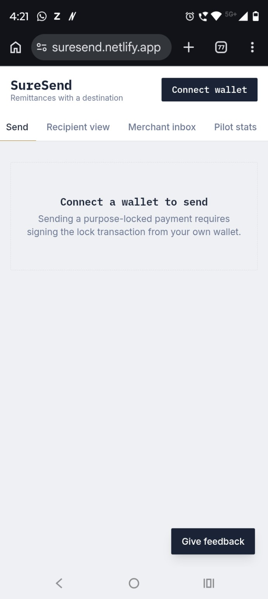
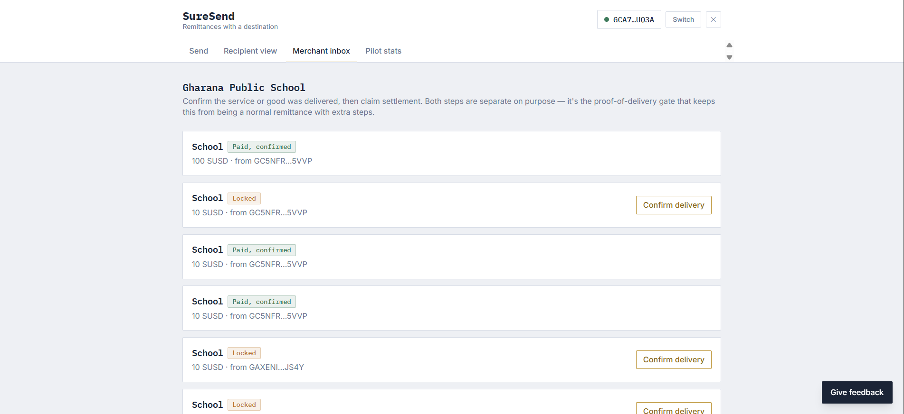
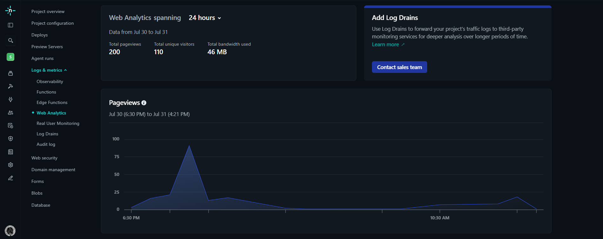
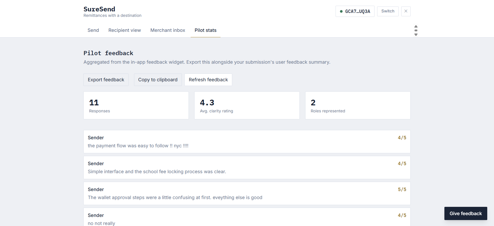
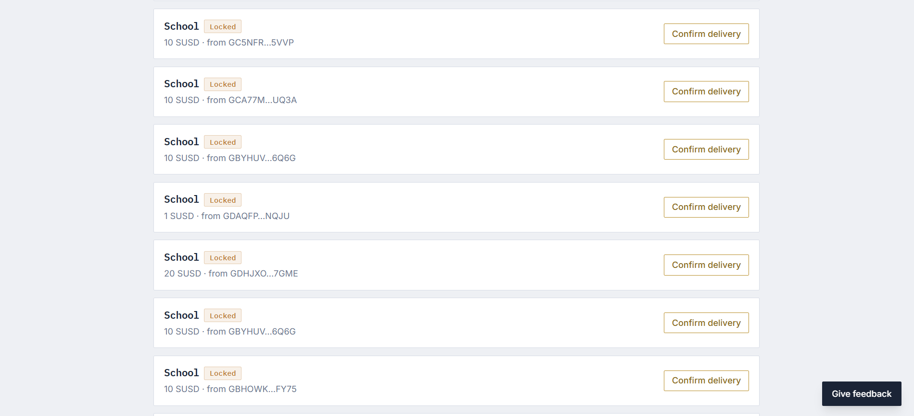
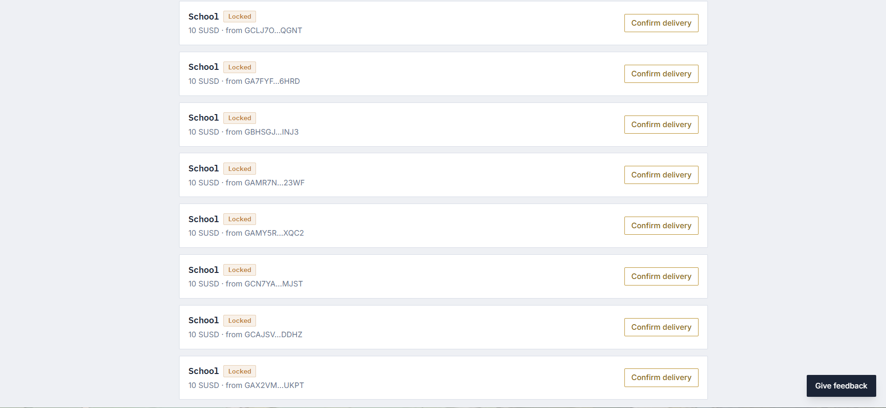

# SureSend

**Purpose-locked remittances on Stellar.** A migrant worker sends money
home for a specific thing — school fees, medicine, a utility bill — and
it can only be redeemed by the specific merchant anchor it was locked to.
If nobody redeems it in time, it either bounces back to the sender or
releases to the recipient, whichever the sender chose up front.

> Remittances have no memory of what they were for once they hit a bank
> account. This gives them one.

This repo is the Level 4 (Green Belt) submission: a production-shaped MVP
of the idea, one category deep (school fees, with medicine/utilities
scaffolded the same way), built to be piloted with one real sending
community and one real school. The pilot ran with 11 Stellar Testnet
users, each connecting a distinct wallet (see
[User onboarding & pilot](#user-onboarding--pilot)).

## Live Deployment

Production MVP: https://suresend.netlify.app

- Network: Stellar Testnet
- Production deployment uses the live Stellar/Soroban integration, not the local demo/localStorage path.
- The deployed experience interacts with the live SureSend and SUSD Testnet contracts listed under [Contract addresses](#contract-addresses).

## Why Stellar

Anchors aren't just generic on/off ramps — they can *be* the merchant.
A school, a pharmacy, a utility provider can each be an anchor. Combined
with a small Soroban contract enforcing "only this merchant, only this
category," you get a remittance that can't drift from its purpose,
without inventing a new compliance/KYC stack — anchors already carry that.
See [`docs/ARCHITECTURE.md`](docs/ARCHITECTURE.md) for the full data flow
and the reasoning behind using a contract instead of native claimable
balances.

## How it works

```
sender picks: category → merchant → amount → fallback → signs
       │
       ▼
Soroban contract locks stablecoin, tagged to that merchant + category
       │
       ▼
merchant confirms delivery (attest_delivery) — funds still locked
       │
       ▼
merchant claims (claim) — funds settle, only now
       │
       ▼
recipient's view shows "locked" → "delivery confirmed" → "paid, confirmed"

  ⤷ if nothing happens before the timeout: anyone can call `expire`,
    which pays out per the sender's original choice (refund / release)
```

## Repo structure

```
contracts/suresend/     Soroban contract (Rust) — the lock/attest/claim/expire state machine
frontend/               React + Vite app — sender, merchant, and recipient views
scripts/                Deploy + merchant-whitelisting helpers for the stellar CLI
docs/                   Architecture, deployment, analytics, and pilot-onboarding docs
```

## Quickstart

### Contract

```bash
cd contracts
cargo test              # runs contracts/suresend/src/test.rs
```

Deploying to testnet requires the `stellar` CLI (v22+) and a funded
identity — see [`docs/DEPLOYMENT.md`](docs/DEPLOYMENT.md) for the full
walkthrough, or run:

```bash
rustup target add wasm32-unknown-unknown
cargo install --locked stellar-cli --features opt
stellar keys generate --global suresend-admin --network testnet --fund
./scripts/deploy_contract.sh
./scripts/whitelist_merchant.sh suresend-admin <CONTRACT_ID> <MERCHANT_ADDRESS> school
```

### Frontend

```bash
cd frontend
cp .env.example .env
npm install
npm run dev
```

The app also supports a local wallet-free demo path with `VITE_DEMO_MODE=true` for local development and walkthroughs. That mode is a convenience only; the production Netlify deployment uses `VITE_DEMO_MODE=false` so the UI interacts with the live Stellar Testnet contracts. The full end-to-end flow (create lock → attest delivery → claim settlement) works against the deployed Testnet contracts in production. See `docs/DEPLOYMENT.md` for the environment-variable reference.

### Loading states and error handling

The production frontend includes:

- **Wallet connection states** — connecting, connected, switch/disconnect, and connection-error handling in `frontend/src/components/ConnectWallet.jsx`.
- **Transaction pending/loading states** — "Enabling SUSD…", "Approving…", and "Signing & locking…" button states while Soroban transactions are being built, signed, and confirmed in `frontend/src/components/SenderFlow.jsx`.
- **SUSD balance checks** — the sender's SUSD balance is read before locking and shown on the review step.
- **Insufficient-balance handling** — a clear message when the requested amount exceeds the wallet's SUSD balance, before any transaction is submitted.
- **Stellar/Soroban error handling** — transaction failures (e.g. token-transfer host errors, failed transactions) are mapped to human-readable messages with retry guidance via the `ErrorBanner` component.

## Contract addresses

| Contract | Address | Network |
|---|---|---|
| SureSend | `CDZP6FOHKYJEK6GCGMDBE5XJMDYLYODTTT7SH74LA3222NUHU27WJLYE` | Stellar Testnet |
| SUSD token | `CBKOVGHJNANMNAHU3IVOFB64PS74QKSQ3KA6PATYDN6N5S7U64UDCXNT` | Stellar Testnet |

## Screenshots

### Product UI / Sender flow





### Mobile responsive design



### Merchant inbox / Merchant flow



### Analytics / monitoring



### Pilot stats / User feedback



### 10+ wallet interactions





## Demo video

[Watch the SureSend live demo on Loom](https://www.loom.com/share/4f89f4c00d4a4311bafda4cb93ebb013)

The demo shows the live Stellar Testnet SureSend purpose-locked payment workflow.

## User onboarding & pilot

The pilot was run with 11 Stellar Testnet users, each connecting a
distinct wallet address. Testers were walked through the end-to-end
workflow:

wallet connection
→ enable SUSD
→ sender flow
→ purpose-locked school-fee payment
→ feedback submission

All 11 testers submitted feedback through the in-app feedback widget from
their own wallet address; the responses are recorded in
`pilot-feedback.json` and aggregated in the app's "Pilot stats" view.

### Pilot wallet interaction proof

The Level 4 requirement is proof of 10+ distinct wallets successfully
interacting with the app. The 11 feedback responses come from 11 distinct
Stellar Testnet wallet addresses, and wallet-interaction screenshots are
embedded in the [Screenshots](#screenshots) section above
(`wallet-proof-1.png` and `wallet-proof-2.png`).

### Pilot feedback summary

SureSend collected 11 pilot feedback responses from distinct Stellar Testnet wallet addresses.

**Pilot results**
- Feedback responses: 11
- Average clarity rating: 4.3/5 (as shown in the in-app Pilot Stats view)
- Roles represented: 2 — 10 Senders, 1 Recipient
- Rating range: 3–5/5

**Key feedback themes**
- Users generally found the interface clean, straightforward, and easy to navigate.
- The school-fee locking/payment flow was generally easy to follow.
- First-time Web3 users found concepts such as enabling SUSD, approving SUSD, and wallet approval confusing.
- Multiple testers suggested stronger onboarding and clearer explanations of blockchain-specific terminology.
- UI refinements were suggested, particularly around transaction/loading button states and the feedback input experience.

Overall, the pilot validated that the core purpose-locked payment flow is usable while highlighting onboarding and Web3 terminology as the main areas for improvement.

Feedback was collected through the in-app feedback widget and aggregated through the Pilot Stats workflow.

For the detailed pilot feedback record and per-user evidence, see [docs/FEEDBACK_TEMPLATE.md](docs/FEEDBACK_TEMPLATE.md).

## Analytics / monitoring

The production deployment uses Netlify Web Analytics for production
traffic monitoring. The app also emits analytics events for wallet
connection, lock creation, delivery attestation, claim, and feedback
submission. See [`docs/ANALYTICS.md`](docs/ANALYTICS.md) for the
monitoring setup and event list.

## Known limitations

- Partial redemption (accumulating several locks toward one larger bill)
  isn't implemented — flagged in the original idea doc as a v2 problem.
- Merchant vetting is manual (`add_merchant`, admin-only) — no on-chain
  identity/KYC check.
- `get_locks_for` is a linear scan, fine for pilot volume, not for scale.
- The frontend's `expire` (timeout refund/release) path isn't wired up in
  the UI yet, since it's time-gated rather than click-driven — the
  contract-side logic is tested in `contracts/suresend/src/test.rs`.

Full detail in [`docs/ARCHITECTURE.md`](docs/ARCHITECTURE.md).

## Testing

- Contract: `cd contracts && cargo test` — requires Rust 1.85+ (install
  via [rustup](https://rustup.rs); older distro-packaged toolchains fail
  on an `edition2024` dependency error — see `docs/DEPLOYMENT.md`).
  See `suresend/src/test.rs` —
  happy path, non-whitelisted merchant, claim-without-attestation,
  double-claim, both expiry fallback directions, and role-filtered
  lookups).
- Frontend: manual click-through via demo mode is the fastest way to
  verify the full flow end to end; see `docs/DEPLOYMENT.md` for the
  suggested demo script.

## Level 4 submission evidence

| Requirement | Status | Evidence |
|---|---|---|
| Production MVP | Complete | [Live deployment](#live-deployment) and [`docs/ARCHITECTURE.md`](docs/ARCHITECTURE.md) |
| Stellar Testnet contracts | Complete | [Contract addresses](#contract-addresses) |
| Public GitHub repository | Complete | https://github.com/N1CK99925/suresend |
| 15+ meaningful commits | Complete | [Commit history](https://github.com/N1CK99925/suresend/commits/main) |
| Production deployment | Complete | https://suresend.netlify.app |
| Mobile responsive UI | Complete | [Mobile responsive design](#mobile-responsive-design) — `docs/screenshots/mobile-ui.png` |
| Analytics/monitoring | Complete | [`docs/ANALYTICS.md`](docs/ANALYTICS.md), the [analytics section](#analytics--monitoring), and `docs/screenshots/analytics.png` |
| 10+ real user onboarding | Complete | [User onboarding & pilot](#user-onboarding--pilot) — 11 pilot participants; `docs/screenshots/pilot-stats.png` |
| 10+ wallet interactions | Complete | [Pilot wallet interaction proof](#pilot-wallet-interaction-proof) — `docs/screenshots/wallet-proof-1.png`, `docs/screenshots/wallet-proof-2.png` |
| Basic user feedback | Complete — 11 responses collected; see [docs/FEEDBACK_TEMPLATE.md](docs/FEEDBACK_TEMPLATE.md) and the Pilot Stats evidence above |
| Demo video | Complete — [Watch the SureSend live demo on Loom](https://www.loom.com/share/4f89f4c00d4a4311bafda4cb93ebb013) |

## License

MIT — see [`LICENSE`](LICENSE).
